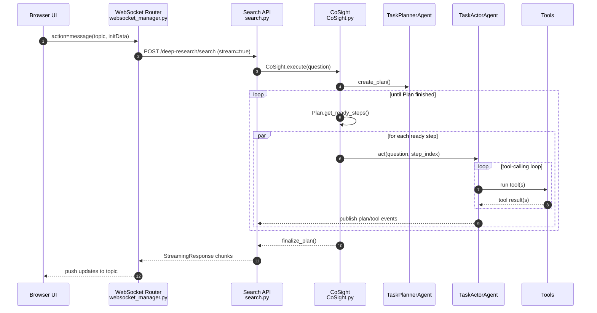
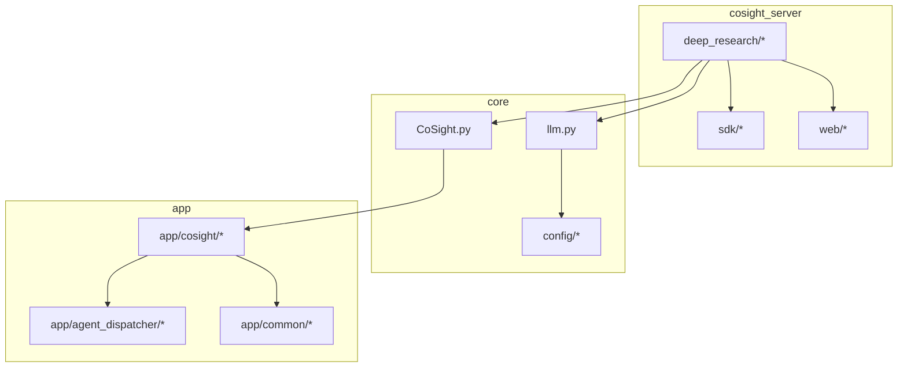
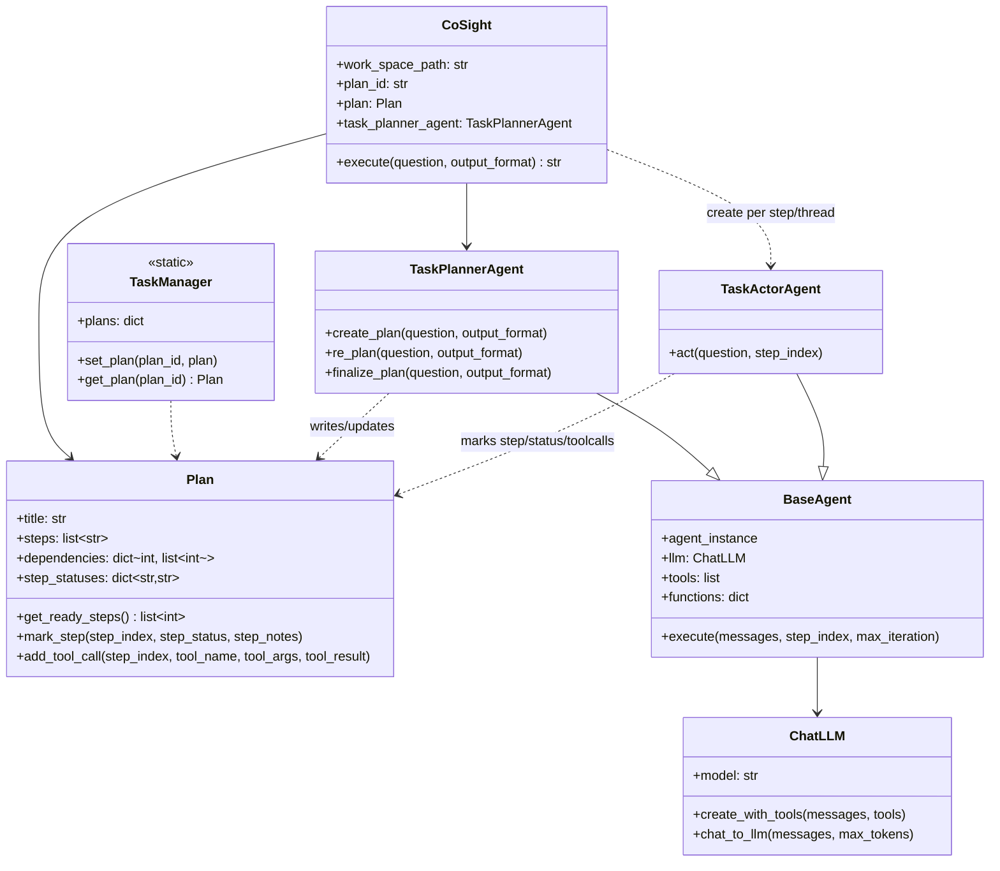

# 09 架构可视化

本页提供“类图形可视化”的项目架构说明，采用 Mermaid（多数 Markdown 渲染器可直接预览）。

## 系统上下文图（Context）

```mermaid
flowchart LR
  U[User/Browser] --> FE[Static Web UI<br/>/cosight]
  FE -->|WebSocket| WS[/WebSocket Gateway<br/>/robot/wss/messages/]
  WS -->|HTTP Streaming| API[/FastAPI API<br/>POST {base_api_url}/deep-research/search/]
  API --> ENG[CoSight Engine]
  ENG --> PLAN[Planner Agent]
  ENG --> ACT[Actor Agents<br/>multi-thread]
  PLAN --> LLM1[(LLM(plan))]
  ACT --> LLM2[(LLM(act/tool/vision))]
  ACT --> TOOLS[Tools<br/>file/search/web/code/doc/vision]
  TOOLS --> FS[(work_space/*)]
  API -->|Static mount| FS
  API --> OBS[(Langfuse<br/>optional)]
  LLM1 --> OBS
  LLM2 --> OBS
```

## 请求时序图（WebSocket → Streaming → 计划执行）



## 模块依赖图（Module Dependency）



## 关键类图（Core Classes）



## 图中对象对应源码

- CoSight 引擎：[CoSight.py](file:///d:/lingdong/Co-Sight/CoSight.py)
- Plan 对象：[todolist.py](file:///d:/lingdong/Co-Sight/app/cosight/task/todolist.py)
- Agent 基类：[base_agent.py](file:///d:/lingdong/Co-Sight/app/cosight/agent/base/base_agent.py)
- Planner Agent：[task_plannr_agent.py](file:///d:/lingdong/Co-Sight/app/cosight/agent/planner/task_plannr_agent.py)
- Actor Agent：[task_actor_agent.py](file:///d:/lingdong/Co-Sight/app/cosight/agent/actor/task_actor_agent.py)
- WebSocket 路由：[websocket_manager.py](file:///d:/lingdong/Co-Sight/cosight_server/deep_research/routers/websocket_manager.py)
- Search API 路由：[search.py](file:///d:/lingdong/Co-Sight/cosight_server/deep_research/routers/search.py)

